```python
# 展示时隐藏代码
import IPython.core.display as di
di.display_html('<script>jQuery(function() {if (jQuery("body.notebook_app").length == 0) { jQuery(".input_area").toggle(); jQuery(".prompt").toggle();}});</script>', raw=True)
```


<script>jQuery(function() {if (jQuery("body.notebook_app").length == 0) { jQuery(".input_area").toggle(); jQuery(".prompt").toggle();}});</script>


```python
import numpy as np
import pandas as pd
import matplotlib.pyplot as plt
```

# 白酒行业基本情况

## 白酒简介

白酒是指以富含淀粉质的粮谷如高粱、大米等为原料，以酒曲即大曲、小曲或麸曲及酒母等为糖化发酵剂，采用固态（个别酒种为半固态或液态）发酵，经蒸煮、糖化、发酵、蒸馏、陈酿、贮存和勾调而制成的蒸馏酒。

白酒又称烧酒、老白干、烧刀子等，是我国特有的酒种，与白兰地、威士忌、伏特加、朗姆酒、杜松子酒（又称金酒）、龙舌兰酒等并列为世界七大蒸馏酒。

白酒酒度一般都在40度以上，但也有40度以下之低度酒。

白酒与中国政治、经济、文化都有着密切的联系，是我国社会交往活动和居民日常生活中的重要饮品。

## 白酒的地域性

中国各地区均有生产白酒，不同地区的名酒各有其突出的独特风格。

下图为全国各地区的名酒及产量分布


```python
display(Image(r'data/白酒地域分布.png'))
```


以2016年计，白酒产量排名前三的省份分别是四川省、河南省和山东省。

排名前10的省份如下


```python
display(Image(r'data/地区产量前10.png'))
```


## 白酒香型

传统的白酒香型主要包括清香型、浓香型、酱香型三大类。目前浓香型白酒约占全部白酒市场份额的 70%

除了传统的三大香型之外，还出现了兼香型、凤香型、米香型、芝麻香型、豉香型、老白干香型、特香型等多种香型。

主要香型及代表品牌如下：


```python
display(Image(r'data/白酒香型.png'))
```


# 白酒行业发展状况

## 行业集中度

### 规模以上企业数和亏损企业数

数据来源于行业协会。

仅统计规模以上企业数。2011年前标准为年收入500万，2011年起则为2000万。


```python
s = pd.read_csv(r'data/company_count.csv')
s['亏损比例'] = s['亏损企业数']/s['企业数']
s.index = [str(i) for i in range(2003, 2017)]
del s['时间']
s
```


<div>
<style>
    .dataframe thead tr:only-child th {
        text-align: right;
    }

    .dataframe thead th {
        text-align: left;
    }

    .dataframe tbody tr th {
        vertical-align: top;
    }
</style>
<table border="1" class="dataframe">
  <thead>
    <tr style="text-align: right;">
      <th></th>
      <th>企业数</th>
      <th>亏损企业数</th>
      <th>亏损比例</th>
    </tr>
  </thead>
  <tbody>
    <tr>
      <th>2003</th>
      <td>1001</td>
      <td>240.0</td>
      <td>0.239760</td>
    </tr>
    <tr>
      <th>2004</th>
      <td>986</td>
      <td>199.0</td>
      <td>0.201826</td>
    </tr>
    <tr>
      <th>2005</th>
      <td>957</td>
      <td>162.0</td>
      <td>0.169279</td>
    </tr>
    <tr>
      <th>2006</th>
      <td>1055</td>
      <td>141.0</td>
      <td>0.133649</td>
    </tr>
    <tr>
      <th>2007</th>
      <td>1159</td>
      <td>123.0</td>
      <td>0.106126</td>
    </tr>
    <tr>
      <th>2008</th>
      <td>1441</td>
      <td>121.0</td>
      <td>0.083969</td>
    </tr>
    <tr>
      <th>2009</th>
      <td>1521</td>
      <td>114.0</td>
      <td>0.074951</td>
    </tr>
    <tr>
      <th>2010</th>
      <td>1626</td>
      <td>105.0</td>
      <td>0.064576</td>
    </tr>
    <tr>
      <th>2011</th>
      <td>1277</td>
      <td>54.0</td>
      <td>0.042287</td>
    </tr>
    <tr>
      <th>2012</th>
      <td>1387</td>
      <td>61.0</td>
      <td>0.043980</td>
    </tr>
    <tr>
      <th>2013</th>
      <td>1423</td>
      <td>86.0</td>
      <td>0.060436</td>
    </tr>
    <tr>
      <th>2014</th>
      <td>1498</td>
      <td>117.0</td>
      <td>0.078104</td>
    </tr>
    <tr>
      <th>2015</th>
      <td>1563</td>
      <td>NaN</td>
      <td>NaN</td>
    </tr>
    <tr>
      <th>2016</th>
      <td>1578</td>
      <td>113.0</td>
      <td>0.071610</td>
    </tr>
  </tbody>
</table>
</div>


```python
fig = plt.figure()
fig.set_figheight(4)
fig.set_figwidth(15)

plt.subplot(131)
s['企业数'].plot(kind='line', marker='o')
plt.title('企业数')
plt.grid(axis='y', linestyle='--')

plt.subplot(132)
s['亏损企业数'].plot(kind='line', marker='o')
plt.title('亏损企业数')
plt.grid(axis='y', linestyle='--')

plt.subplot(133)
s['亏损比例'].plot(kind='line', marker='o')
plt.title('亏损比例')
plt.grid(axis='y', linestyle='--')

plt.savefig(r'pic/行业企业数.png')
plt.show();
```


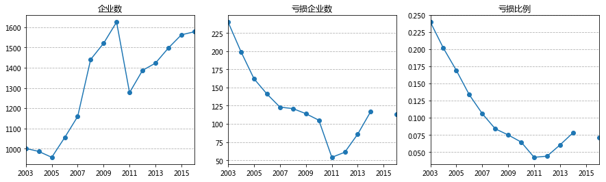


由于2011年变更统计标准，导致行业企业数突降。

但单看两侧，2005年之后每年规模以上企业数都在增加。

亏损企业方面，2003-2010年亏损企业数一直减少；2012年开始亏损企业数开始增多。亏损企业数比例也与此一致。

### 行业CR4占比

当前行业内有18000多家企业，前100家企业的规模占到总行业的90%。

这里选取贵州茅台、五粮液、洋河股份和泸州老窖四家企业的营收数据分析行业集中度情况。


```python
import matplotlib.ticker as mtick
fmt = '%.0f%%'  #不保留小数
yticks = mtick.FormatStrFormatter(fmt)

s = pd.DataFrame()
s['收入'] = [2661.14, 3746.67, 4461, 5018, 5258.89, 5558.86, 6125.74]
s['CR4收入'] = [401.64, 599.22, 824.82, 810.96, 726.1, 772.71, 888.93]
s['CR4占比'] = s['CR4收入']/s['收入']*100
s.index = range(2010, 2017)

fig = plt.figure()

ax = s[['收入', 'CR4收入']].plot(kind='bar', use_index=True)
ax.grid(linestyle='--', linewidth=1, axis='y')
plt.title('CR4收入及占比')
plt.ylabel('单位：亿元')
plt.legend(('收入', 'CR4收入'))

ax2 = ax.twinx()
ax2.plot(ax.get_xticks(), s[['CR4占比']], linestyle='-', marker='o', linewidth=2.0)
ax2.yaxis.set_major_formatter(yticks)
plt.ylabel('CR4占比')
plt.legend(('CR4占比', ), loc='upper center')

plt.savefig(r'pic/CR4收入及占比.png')
plt.show();
```


    <matplotlib.figure.Figure at 0x2302d04d0b8>


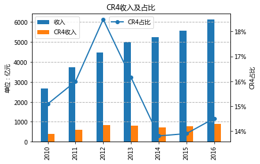


从CR4营收占比来看，大致在14%-18%之间。2012年以前占比逐渐提升，此后两年迅速下降，最近两年又略有提升。

总体来看，白酒行业集中度还是很低。

## 产销量数据

**数据来源：**国家统计局（折合为65度白酒，产量为月度数据，销量为季度数据）

**月度数据：**包含每月产量、累计产量；数据从1989年起；缺少的数据：1994/1996年，199807-199812；200001-200003；201601-201602

**季度数据：**包含销量、产销率、期末库存；自1998年起

**产销率**：销售量/生产量

**注意：**统计口径有一定变化，如下图所示


```python
from IPython.display import display, Image
# display(Image(r'pic/1.png', width=100))
display(Image(r'pic/白酒统计口径.png'))
```


```python
output = pd.read_csv(r'data/月度数据.csv', skiprows=2, skipfooter=2, engine='python')
```


```python
s = []
for i in output['时间']:
    s.append(i.replace('年', '-').replace('月', ''))
output.index = [pd.to_datetime(t) for t in s]
```


```python
del output['时间']
```


```python
output.columns = ['白酒当期产量', '白酒累计产量', '白酒同比增长', '白酒累计增长']
```

### 白酒产量数据


```python
output['白酒当期产量'].plot(kind='line', figsize = (10, 5))
# plt.grid(axis='y', linestyle='--')
plt.title('白酒每月产量')
plt.ylabel('单位：万千升')
plt.grid(linestyle='--')
plt.savefig(r'pic/白酒每月产量.png')
plt.show();
```


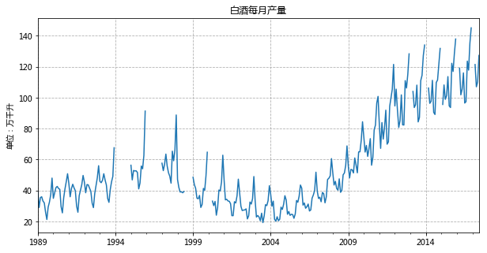


#### 白酒的季节性特征


```python
s = output['白酒当期产量'][-12:]
# s.index = ['201607', '201608', '201609', '201610', '201611', '201612', '201701', '201702', '201703', '201704', '201705', '201706']
a = pd.date_range(start='2016-07', end='2017-07', freq='M')
a = [str(i)[:7] for i in a]

s.index = a
s.plot(kind='bar')
plt.grid(axis='y', linestyle='--')
plt.title('最近一年每月产量')
plt.ylabel('单位：万千升')
# plt.grid(linestyle='--')
plt.savefig(r'pic/最近一年每月产量.png')
plt.show();
```


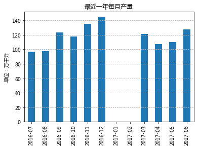


从上面的信息可以看到（白酒产销一般情况较为接近），白酒生产具有鲜明的季节性，一年中呈现出明显的淡旺季特征。以过去12个月为例，7-8月份为淡季；到
了年底则进入行业旺季。

背后的原因也很显然，节假日白酒的消费量比平日要多很多，如春节、国庆中秋节等都是传统的白酒旺季。

#### 白酒行业历年发展


```python
output_year = output[output.index.month == 12]
output_year.index = range(1989, 2017)
```


```python
output_year['白酒累计产量'].plot(marker='o')
plt.title('白酒历年产量')
plt.ylabel('单位：万千升')
plt.grid(linestyle='--')
plt.savefig(r'pic/白酒历年产量.png')
plt.show();
```


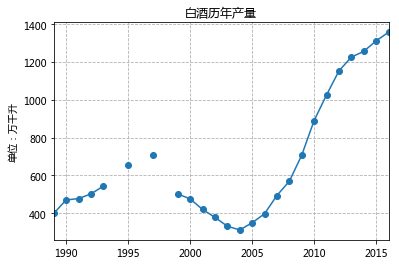


从上图可以看到，自1989年之后，白酒产量在1997年达到最高峰。

1998年后产量一路下滑，一直到2004年产量到达谷底（此时白酒产量甚至比1989年还要低很多）。

2004年之后，白酒行业发展较为迅速，一直高速增长到2012年;期间白酒产销率年复合均增速达到17.31%和17.77%。

2012年之后白酒行业不再高速增长，但行业总产量仍然继续增加。

下面把目光聚集在白酒行业的两个转折点：

1. 1998-2004年的产量下滑：

    a. 一方面因为统计口径的变化，1998年开始只统计500万产值以上的企业；

    b. 另一方面也是最主要的原因。1998年发生了影响较大的“朔州毒酒案”，全国开始全面清理整顿白酒行业。
    
    c. 产业政策方面：
    
    在之前的1997年，中国轻工总会发布酿酒行业环保政策​，严格控制酒类企业生产能力；
    
    其后在2001年，白酒行业的税收在原来基础上，每斤要多收0.5元的消费税。  

2. 2012年行业增速的转折

    a. 此次调整主要是由于限制三公消费，2012年初央视抛出“限酒令”，3月底国务院严格控制“三公”经费，年底则有中央军委下发的“禁酒令”
    
    b. 此外还有2012年年中的酒鬼酒“塑化剂”风波。

### 白酒销量数据


```python
sales = pd.read_csv(r'data/季度数据.csv', skiprows=2, skipfooter=1, engine='python')
```


```python
sales.index = pd.date_range(start='1998Q1', end='2017Q3', freq='Q')
```


```python
del sales['时间']
```


```python
sales.columns = ['白酒累计销售', '白酒产销率', '产销率同比', '库存比年初增长']
```

#### 白酒产销率


```python
sales['白酒产销率'].plot(kind='line', figsize = (10, 5))
# plt.grid(axis='y', linestyle='--')
plt.title('白酒每季产销率')
# plt.ylabel('单位：万千升')
plt.grid(axis='y', linestyle='--')
plt.savefig(r'pic/白酒每季产销率.png')
plt.show();
```


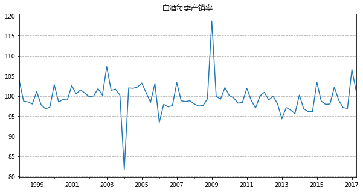


从产销率数据来看，大多数时候白酒行业产销量都接近100%，波动幅度在95%和105%之间。

其中有两个峰值分别出现在2004年和2009年：

2004年的产销率一度降到80%的水平，这也与之前提到的2004年产量谷底相一致；

2009年产销率则最高接近120%，此时正是白酒行业高速发展中。

#### 白酒销量


```python
sales_year = sales[sales.index.month == 12]
```


```python
sales_year.index = range(1998, 2017)
```


```python
sales_year
```


<div>
<style>
    .dataframe thead tr:only-child th {
        text-align: right;
    }

    .dataframe thead th {
        text-align: left;
    }

    .dataframe tbody tr th {
        vertical-align: top;
    }
</style>
<table border="1" class="dataframe">
  <thead>
    <tr style="text-align: right;">
      <th></th>
      <th>白酒累计销售</th>
      <th>白酒产销率</th>
      <th>产销率同比</th>
      <th>库存比年初增长</th>
    </tr>
  </thead>
  <tbody>
    <tr>
      <th>1998</th>
      <td>549.1</td>
      <td>98.0</td>
      <td>NaN</td>
      <td>10.3</td>
    </tr>
    <tr>
      <th>1999</th>
      <td>480.6</td>
      <td>97.2</td>
      <td>NaN</td>
      <td>16.2</td>
    </tr>
    <tr>
      <th>2000</th>
      <td>468.8</td>
      <td>99.0</td>
      <td>NaN</td>
      <td>0.4</td>
    </tr>
    <tr>
      <th>2001</th>
      <td>419.5</td>
      <td>100.7</td>
      <td>NaN</td>
      <td>-3.2</td>
    </tr>
    <tr>
      <th>2002</th>
      <td>373.5</td>
      <td>100.2</td>
      <td>NaN</td>
      <td>1.2</td>
    </tr>
    <tr>
      <th>2003</th>
      <td>330.1</td>
      <td>100.2</td>
      <td>NaN</td>
      <td>-0.9</td>
    </tr>
    <tr>
      <th>2004</th>
      <td>314.2</td>
      <td>102.2</td>
      <td>NaN</td>
      <td>-12.9</td>
    </tr>
    <tr>
      <th>2005</th>
      <td>358.1</td>
      <td>103.1</td>
      <td>0.9</td>
      <td>-1.2</td>
    </tr>
    <tr>
      <th>2006</th>
      <td>383.9</td>
      <td>97.6</td>
      <td>-5.5</td>
      <td>8.2</td>
    </tr>
    <tr>
      <th>2007</th>
      <td>485.2</td>
      <td>98.8</td>
      <td>1.2</td>
      <td>3.6</td>
    </tr>
    <tr>
      <th>2008</th>
      <td>562.1</td>
      <td>99.3</td>
      <td>-0.1</td>
      <td>18.9</td>
    </tr>
    <tr>
      <th>2009</th>
      <td>628.5</td>
      <td>102.1</td>
      <td>1.3</td>
      <td>2.2</td>
    </tr>
    <tr>
      <th>2010</th>
      <td>873.3</td>
      <td>98.4</td>
      <td>-1.4</td>
      <td>12.6</td>
    </tr>
    <tr>
      <th>2011</th>
      <td>1021.8</td>
      <td>100.0</td>
      <td>0.2</td>
      <td>16.6</td>
    </tr>
    <tr>
      <th>2012</th>
      <td>1126.7</td>
      <td>98.1</td>
      <td>0.9</td>
      <td>20.1</td>
    </tr>
    <tr>
      <th>2013</th>
      <td>1166.2</td>
      <td>95.6</td>
      <td>-3.5</td>
      <td>46.5</td>
    </tr>
    <tr>
      <th>2014</th>
      <td>1202.6</td>
      <td>96.1</td>
      <td>0.7</td>
      <td>27.7</td>
    </tr>
    <tr>
      <th>2015</th>
      <td>1278.8</td>
      <td>98.0</td>
      <td>2.5</td>
      <td>15.9</td>
    </tr>
    <tr>
      <th>2016</th>
      <td>1305.7</td>
      <td>96.9</td>
      <td>0.1</td>
      <td>14.8</td>
    </tr>
  </tbody>
</table>
</div>


```python
sales_year['白酒累计销售'].plot(marker='o')
# plt.grid(axis='y', linestyle='--')
plt.title('白酒历年销量')
plt.ylabel('单位：万千升')
plt.grid(axis='y', linestyle='--')
plt.savefig(r'pic/白酒历年销量.png')
plt.show();
```


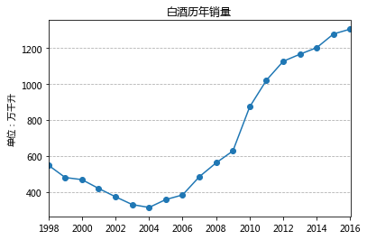


从销量数据来看，与产量数据也较为一致。

白酒销量自1998年一路下滑，直至2005年探底。此后则属于高速增长期，知道2013年开始增速降低

### 白酒库存变化


```python
sales_year['库存比年初增长'].plot(marker='o')
# plt.grid(axis='y', linestyle='--')
plt.title('白酒历年库存变化率')
# plt.ylabel('单位：万千升')
plt.grid(axis='y', linestyle='--')
plt.savefig(r'pic/白酒历年库存变化率.png')
plt.show();
```


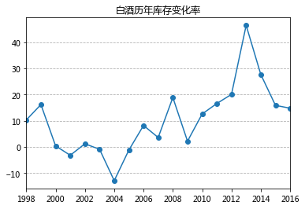


从库存变化率来看，仅2002/2004-2006三年库存有所减少，其他年份库存均为增长。

另外前面提到的2012年度白酒行业增速下降（意味着产品积压），这里单看库存变化，确实是2012年之后每年库存增长都不少，2014年度库存甚至增加了将近50%，最近两年则略有好转。

### 产销量及增速总览


```python
import matplotlib.ticker as mtick
fmt = '%.0f%%'  #不保留小数
yticks = mtick.FormatStrFormatter(fmt)

s = pd.DataFrame()
s['产量'] = output_year['白酒累计产量'][-19:]
s['销量'] = sales_year['白酒累计销售']
s['产量增速'] = s['产量'].pct_change(axis=0)*100
s['销量增速'] = s['销量'].pct_change(axis=0)*100
s.index = range(1998, 2017)

fig = plt.figure()

ax = s[['产量', '销量']].plot(kind='bar', use_index=True)
ax.grid(linestyle='--', linewidth=1, axis='y')
plt.title('产销量及增速')
plt.ylabel('单位：万千升')
plt.legend(('产量', '销量'))

ax2 = ax.twinx()
ax2.plot(ax.get_xticks(), s[['产量增速', '销量增速']], linestyle='-', marker='o', linewidth=2.0)
ax2.yaxis.set_major_formatter(yticks)
plt.ylabel('增速')
plt.legend(('产量增速', '销量增速'), loc='upper center')

plt.savefig(r'pic/产销量及增速.png')
plt.show();
```


    <matplotlib.figure.Figure at 0x2302ca434a8>


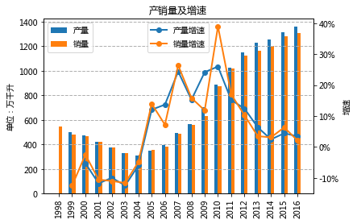


## 行业销售收入和销售单价

### 销售收入


```python
s = pd.DataFrame()
s['销售收入'] = [741.07, 971.4, 1241.96, 1574.85, 2095.17, 2661.14, 3746.67, 4461, 5018, 5258.89, 5558.86, 6125.74]
s['销量'] = [358.1, 383.9, 485.2, 562.1, 628.5, 873.3, 1021.8, 1126.7, 1166.2, 1202.6, 1278.8, 1305.7]
s['销售单价'] = s['销售收入'] / s['销量']
s['销售收入增速'] = s['销售收入'].pct_change(axis=0) * 100
s['销售单价增速'] = s['销售单价'].pct_change(axis=0) * 100
s.index = range(2005, 2017)
# s.to_csv(r'data/销售收入.csv')
fig = plt.figure()

ax = s[['销售收入']].plot(kind='bar', use_index=True)
ax.grid(linestyle='--', linewidth=1, axis='y')
plt.title('销售收入及增速')
plt.ylabel('单位：亿元')
plt.legend(('销售收入', ))

ax2 = ax.twinx()
ax2.plot(
    ax.get_xticks(), s[['销售收入增速']], color='r', linestyle='-', marker='o', linewidth=2.0)
ax2.yaxis.set_major_formatter(yticks)
plt.ylabel('增速')
plt.legend(('增速', ), loc='upper center')

plt.savefig(r'pic/销售收入及增速.png')
plt.show()
```


    <matplotlib.figure.Figure at 0x2302ca43358>


### 销售单价


```python
fig = plt.figure()

ax = s[['销售单价']].plot(kind='bar', use_index=True)
ax.grid(linestyle='--', linewidth=1, axis='y')
plt.title('销售单价及增速')
plt.ylabel('单位：万元/千升')
plt.legend(('销售单价', ))

ax2 = ax.twinx()
ax2.plot(ax.get_xticks(), s[['销售单价增速']], color='r', linestyle='-', marker='o', linewidth=2.0)
ax2.yaxis.set_major_formatter(yticks)
plt.ylabel('增速')
plt.legend(('增速',), loc='upper center')

plt.savefig(r'pic/销售单价及增速.png')
plt.show();
```


    <matplotlib.figure.Figure at 0x2302ca1b240>


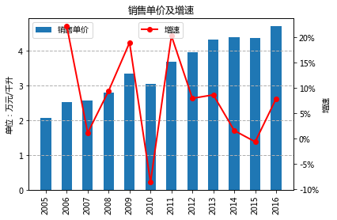


### 总结

**1.从销售收入来看，和前面结果类似。**

从2005年之后，行业销售收入维持高增长,2011年增速最高达到40%。

2012年之后增速下降，14年增速下降至谷底，近三年维持较低增速。

**2.从销售单价来看。**

总体趋势上，销售单价逐渐增长。2005-2016年间销售单价上涨一倍多。

# 行业上下游

白酒产业链的上游企业主要为白酒生产企业提供酿酒原材料、包装材料、半成品、产成品等。

白酒生产企业根据生产流程，对原材料进行一系列加工后生产出白酒及其副产品，通过包装、物流公司，提供给各级经销商并最终达到消费者手中。

## 上游行业

### 粮食种植业

高粱、小麦、大米、糯米、玉米、大麦等谷物是白酒酿造的主要原料。

近年来粮食产量逐年增长，粮食自给率始终保持在95%以上。酿酒用粮食基本可以稳定供应。


### 包装印刷业

白酒产品配套的包装材料主要包括酒瓶、酒坛、瓶盖、外包装盒等，因供货商众多，产业规模巨大，白酒生产企业的选择余地较大。

## 下游行业

白酒行业下游产业主要为白酒产品的批发与零售，包括经销商、酒店、商超、专卖、电子商务平台等。

批发与零售业通过直销或代销方式将产品最终销售至终端消费者。

我国批发与零售行业企业数量众多，行业集中度低，市场竞争激烈，白酒生产企业可根据销售策略选择销售渠道。

对于白酒企业而言，在产业链中处于最核心的位置，因此一般更为强势。

此外，很多企业也要一定程度上谋求对产业链进行部分整合。

# 行业需求分析

## 需求影响因素


```python
display(Image(r'data/白酒需求.jpg'))
```


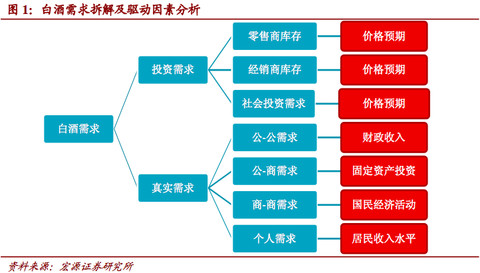


在白酒需求方面，投资方面的需求较难分析，这里只分析真实需求方面。

由于近年来限制三公消费的政策，公-公需求一再被压缩。例如茅台，（根据2016年袁仁国的说法）公务消费从2012年的销量占比30%以上，降到2016年的不足1%。

公-商需求、商-商需求和个人需求本身很难得到准确的统计数字，但分别可以从固定资产投资、餐饮业营收和居民收入水平三方面作为了解。


```python
s = pd.DataFrame()
s['固定资产投资'] = [88773.62, 109998.2, 137323.94, 172828.4, 224598.77, 251683.77, 311485.13, 374694.74, 446294.09, 512020.65, 561999.83]
s['餐饮业营业额'] = [1260.2, 1573.6, 1907.22, 2592.82, 2686.36, 3195.14, 3809.05, 4419.85, 4533.33, 4615.3, 4864.01]
s['城镇人均收入'] = [10493, 11759.5, 13785.8, 15780.8, 17174.7, 19109.4, 21809.8, 24564.7, 26467, 28843.85, 31194.83]
s['投资增长率'] = s['固定资产投资'].pct_change(axis=0) * 100
s['餐饮增长率'] = s['餐饮业营业额'].pct_change(axis=0) * 100
s['城镇收入增长率'] = s['城镇人均收入'].pct_change(axis=0) * 100

s.index = range(2005, 2016)

fig = plt.figure()
fig.set_figheight(4)
fig.set_figwidth(15)

plt.subplot(131)
s['投资增长率'].plot(kind='line', marker='o')
plt.title('投资增长率')
plt.grid(axis='y', linestyle='--')

plt.subplot(132)
s['餐饮增长率'].plot(kind='line', marker='o')
plt.title('餐饮增长率')
plt.grid(axis='y', linestyle='--')

plt.subplot(133)
s['城镇收入增长率'].plot(kind='line', marker='o')
plt.title('城镇收入增长率')
plt.grid(axis='y', linestyle='--')

plt.savefig(r'pic/投资餐饮收入增长率.png')
plt.show();
```


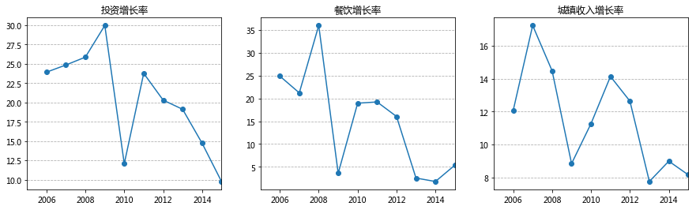


从上图可以看到，近10年来，固定资产投资、餐饮业收入、城镇居民人均可支配收入均一致增加。但从增速上来说，近几年的增速明显降低。

## 个人需求

### 人口数据


```python
population_age = pd.read_csv(r'data/人口年龄结构.csv', skiprows=2, skipfooter=2, engine='python')
population_age.index = range(1989, 2016)
# population_age.iloc[1:, 7:13].sum(axis=1)
```


```python
people_2 = pd.read_csv(r'data/人口年龄结构_抽样.csv', skiprows=2, skipfooter=2, engine='python')


people_2.iloc[1:, 7:13]

a = people_2.iloc[1:, 7:13].sum(axis=1)

b = people_2.iloc[1:, 1]

# 25-54岁人群所占比例
c = a/b
```


```python
fig = plt.figure()
fig.set_figheight(4)
fig.set_figwidth(16)

plt.subplot(141)
population_age['年末总人口(万人)'].plot(kind='line', marker='o')
plt.title('人口数')
plt.ylabel('单位：万人')
plt.grid(axis='y', linestyle='--')

plt.subplot(142)
population_age['0-14岁人口(万人)'].plot(kind='line', marker='o')
plt.title('0-14岁人口数')
plt.grid(axis='y', linestyle='--')

plt.subplot(143)
population_age['15-64岁人口(万人)'].plot(kind='line', marker='o')
plt.title('15-64岁人口数')
plt.grid(axis='y', linestyle='--')

plt.subplot(144)
population_age['65岁及以上人口(万人)'].plot(kind='line', marker='o')
plt.title('65岁以上人口数')
plt.grid(axis='y', linestyle='--')

plt.savefig(r'pic/人口数数据.png')
plt.show();
```


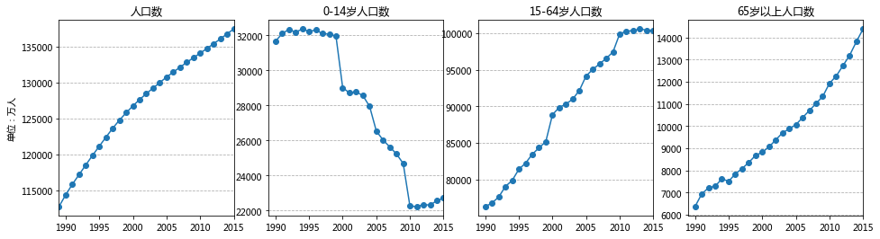


从人口数来看，15-64岁年龄段的人群数目一直在增长，但2010年开始基本不再增长（2015年首次出现下降）；而0-14岁人口数则基本处于下降趋势，2010年后有小幅增长；65岁以上人口则在一直增加。

### 人均可支配收入

人均可支配收入数据来源于国家统计局。需要注意的是，2013年开始统计口径等均有变化


```python
income = pd.read_csv(r'data/城乡人均收入年度数据.csv', skiprows=2, skipfooter=2, engine='python')
```


```python
s = pd.DataFrame()
s['城镇人均收入'] = income['城镇居民家庭人均可支配收入(元)']
s['农村人均收入'] = income['农村居民家庭人均纯收入(元)']
s.index = range(1989, 2013)

s.plot(marker='o')
plt.grid(axis='y', linestyle='--')
plt.title('城乡人均收入')
plt.ylabel('单位：元')
plt.savefig(r'pic/城乡人均收入.png')
plt.show()
```


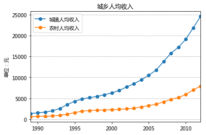


```python
s = pd.DataFrame()
s['城镇人均收入'] = income['城镇居民家庭人均可支配收入(元)'][-18:]
s['农村人均收入'] = income['农村居民家庭人均纯收入(元)'][-18:]
s['城镇人均消耗'] = [9.93, 9.72, 9.55, 9.68, 9.61, 10.01, 9.68, 9.12, 9.39, 8.94, 8.85, 9.12, 9.14, 7.62, 7.99, 7.02, 6.76, 6.88]
s['农村人均消耗'] = [6.53, 7.11, 7.13, 6.98, 6.98, 7.02, 7.1, 7.5, 7.67, 7.84, 9.59, 9.97, 10.18, 9.67, 10.08, 9.74, 10.15, 10.04]
s.index = range(1995, 2013)

fig = plt.figure()

ax = s[['城镇人均消耗', '农村人均消耗']].plot(kind='bar', use_index=True)
ax.grid(linestyle='--', linewidth=1, axis='y')
plt.title('城乡人均收入及酒类消耗')
plt.ylabel('单位：千克')
plt.legend(('城镇消耗', '农村消耗'), bbox_to_anchor=(-0.1, 0.95))

ax2 = ax.twinx()
ax2.plot(ax.get_xticks(), s[['城镇人均收入', '农村人均收入']], linestyle='-', marker='o', linewidth=2.0)
plt.ylabel('人均收入：元')
plt.legend(('城镇收入', '农村收入'), bbox_to_anchor=(-0.1, 0.75))

plt.savefig(r'pic/城乡人均收入及酒类消耗.png')
plt.show();
```


    <matplotlib.figure.Figure at 0x2302b370278>


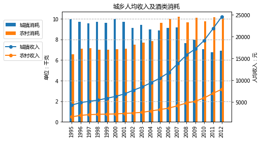


```python
s.T
```


<div>
<style>
    .dataframe thead tr:only-child th {
        text-align: right;
    }

    .dataframe thead th {
        text-align: left;
    }

    .dataframe tbody tr th {
        vertical-align: top;
    }
</style>
<table border="1" class="dataframe">
  <thead>
    <tr style="text-align: right;">
      <th></th>
      <th>1995</th>
      <th>1996</th>
      <th>1997</th>
      <th>1998</th>
      <th>1999</th>
      <th>2000</th>
      <th>2001</th>
      <th>2002</th>
      <th>2003</th>
      <th>2004</th>
      <th>2005</th>
      <th>2006</th>
      <th>2007</th>
      <th>2008</th>
      <th>2009</th>
      <th>2010</th>
      <th>2011</th>
      <th>2012</th>
    </tr>
  </thead>
  <tbody>
    <tr>
      <th>城镇人均收入</th>
      <td>4283.00</td>
      <td>4838.90</td>
      <td>5160.30</td>
      <td>5425.10</td>
      <td>5854.00</td>
      <td>6280.00</td>
      <td>6859.60</td>
      <td>7702.80</td>
      <td>8472.20</td>
      <td>9421.60</td>
      <td>10493.00</td>
      <td>11759.50</td>
      <td>13785.80</td>
      <td>15780.80</td>
      <td>17174.70</td>
      <td>19109.40</td>
      <td>21809.80</td>
      <td>24564.70</td>
    </tr>
    <tr>
      <th>农村人均收入</th>
      <td>1577.70</td>
      <td>1926.10</td>
      <td>2090.10</td>
      <td>2162.00</td>
      <td>2210.30</td>
      <td>2253.40</td>
      <td>2366.40</td>
      <td>2475.60</td>
      <td>2622.20</td>
      <td>2936.40</td>
      <td>3254.90</td>
      <td>3587.00</td>
      <td>4140.40</td>
      <td>4760.60</td>
      <td>5153.20</td>
      <td>5919.00</td>
      <td>6977.30</td>
      <td>7916.60</td>
    </tr>
    <tr>
      <th>城镇人均消耗</th>
      <td>9.93</td>
      <td>9.72</td>
      <td>9.55</td>
      <td>9.68</td>
      <td>9.61</td>
      <td>10.01</td>
      <td>9.68</td>
      <td>9.12</td>
      <td>9.39</td>
      <td>8.94</td>
      <td>8.85</td>
      <td>9.12</td>
      <td>9.14</td>
      <td>7.62</td>
      <td>7.99</td>
      <td>7.02</td>
      <td>6.76</td>
      <td>6.88</td>
    </tr>
    <tr>
      <th>农村人均消耗</th>
      <td>6.53</td>
      <td>7.11</td>
      <td>7.13</td>
      <td>6.98</td>
      <td>6.98</td>
      <td>7.02</td>
      <td>7.10</td>
      <td>7.50</td>
      <td>7.67</td>
      <td>7.84</td>
      <td>9.59</td>
      <td>9.97</td>
      <td>10.18</td>
      <td>9.67</td>
      <td>10.08</td>
      <td>9.74</td>
      <td>10.15</td>
      <td>10.04</td>
    </tr>
  </tbody>
</table>
</div>


可以看到1995-2012年间，城镇居民人均收入从4283元上升到了24564元；与此同时，人均酒类消耗则由9.93千克降到了6.88千克。
农村居民人均收入从1578元上升到了7917元；人均酒类消耗由6.53千克上升到10.04千克。

### 世界人均饮酒量

#### 世界人均酒精消费量

数据主要来自于WHO。

这里的酒精摄入量计算方法为：将各种酒消费量乘以其酒精度数，从而得到其纯酒精的消费量，最后进行加总。


```python
display(Image(r'data/OPEC.png'))
```


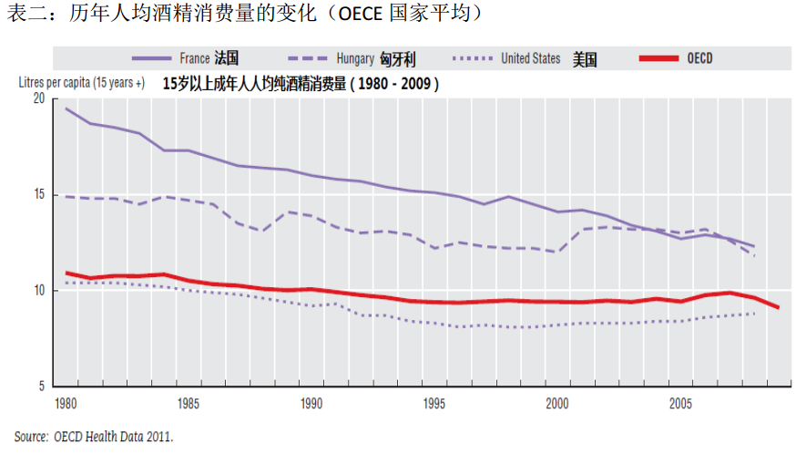


从时间维度上来看，图中各个国家的人均酒精消费量一直呈现下降趋势。


```python
display(Image(r'data/Global_consumption_percapita_2010.png'))
```


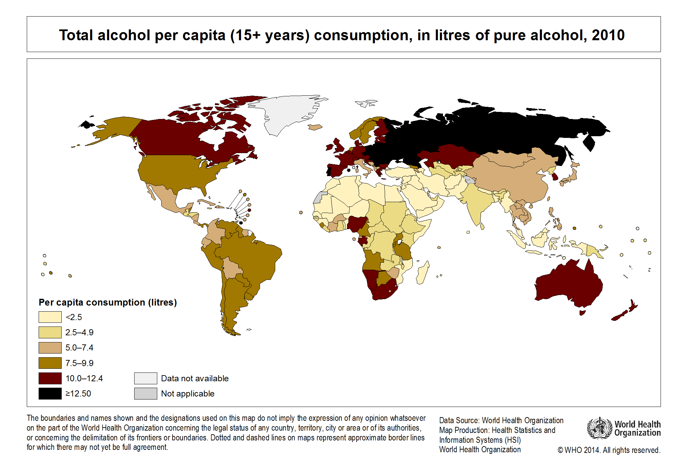


上图为2010年世界各国人均酒精消费量（更详细的数据见http://gamapserver.who.int/gho/interactive_charts/gisah/consumption_adult/atlas.html ）。统计的是15岁以上人群。图中颜色越深，表示人均酒精消费量越多。

可以看到，2010年人均酒精消费量较多的国家包括俄罗斯和部分欧洲国家、加拿大、澳大利亚等。

中国落在5.0-7.4 L/人的区间；美国是7.5-9.9 L/人；欧洲则为10.0L/人以上。

可以推断，人均酒精摄入量与经济发达程度、纬度都有关系：
经济越发达，人均收入越高，酒精摄入量越大；
纬度越高（气温更低），酒精摄入量也相对增大。
**对于中国未来的情况而言，可能大致跟纬度接近的美国类似。**

#### 中美两国对比

根据OPEC数据，2008-2010期间中国人均酒精摄入量为6.7L/人，美国则为9.2L/人。

按性别看，中国和美国女性/男性的人均数据分别为2.2/10.9，4.9/13.6。中国的人均数据均低于美国。不过美国男性人均是女性2.5倍左右，中国则是5倍。

此外，单独计算饮酒者人均摄入量时，2008-2010中国饮酒者人均摄入量已经达到15.14L/人，美国则为13.27L/人。中国实际上已经超过美国。

#### 近几年中国人均酒精测算

数据来自国家统计局，为规模以上企业；葡萄酒为测算；2016啤酒为产量代替；黄酒、2016人口为估算；进口啤酒未计入					

计算酒精量时白酒为65%，啤酒按4%酒精度，葡萄酒按12%，黄酒按16%					


```python
display(Image(r'data/人均酒精量测算.png'))
```


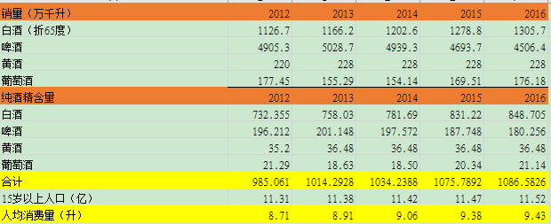


经大致计算，2016年中国人均酒精消耗量达到9.43L。WHO的数据，美国2016年则为9.3L。

### 国内人均数据

#### 15-64岁人均白酒销量


```python
s = pd.DataFrame()
s['15-64'] = population_age['15-64岁人口(万人)'][-13:]
s['白酒销量'] = [i for i in sales_year['白酒累计销售'][-13:]]
sales_year['白酒累计销售'][-13:]
s['15-64人均'] = s['白酒销量']/s['15-64']*1000
s.index = range(2003, 2016)
s
```


<div>
<style>
    .dataframe thead tr:only-child th {
        text-align: right;
    }

    .dataframe thead th {
        text-align: left;
    }

    .dataframe tbody tr th {
        vertical-align: top;
    }
</style>
<table border="1" class="dataframe">
  <thead>
    <tr style="text-align: right;">
      <th></th>
      <th>15-64</th>
      <th>白酒销量</th>
      <th>15-64人均</th>
    </tr>
  </thead>
  <tbody>
    <tr>
      <th>2003</th>
      <td>90976.0</td>
      <td>314.2</td>
      <td>3.453658</td>
    </tr>
    <tr>
      <th>2004</th>
      <td>92161.0</td>
      <td>358.1</td>
      <td>3.885592</td>
    </tr>
    <tr>
      <th>2005</th>
      <td>94144.0</td>
      <td>383.9</td>
      <td>4.077796</td>
    </tr>
    <tr>
      <th>2006</th>
      <td>95037.0</td>
      <td>485.2</td>
      <td>5.105380</td>
    </tr>
    <tr>
      <th>2007</th>
      <td>95794.0</td>
      <td>562.1</td>
      <td>5.867800</td>
    </tr>
    <tr>
      <th>2008</th>
      <td>96547.0</td>
      <td>628.5</td>
      <td>6.509783</td>
    </tr>
    <tr>
      <th>2009</th>
      <td>97419.0</td>
      <td>873.3</td>
      <td>8.964370</td>
    </tr>
    <tr>
      <th>2010</th>
      <td>99898.0</td>
      <td>1021.8</td>
      <td>10.228433</td>
    </tr>
    <tr>
      <th>2011</th>
      <td>100243.0</td>
      <td>1126.7</td>
      <td>11.239688</td>
    </tr>
    <tr>
      <th>2012</th>
      <td>100334.0</td>
      <td>1166.2</td>
      <td>11.623179</td>
    </tr>
    <tr>
      <th>2013</th>
      <td>100557.0</td>
      <td>1202.6</td>
      <td>11.959386</td>
    </tr>
    <tr>
      <th>2014</th>
      <td>100398.0</td>
      <td>1278.8</td>
      <td>12.737306</td>
    </tr>
    <tr>
      <th>2015</th>
      <td>100361.0</td>
      <td>1305.7</td>
      <td>13.010034</td>
    </tr>
  </tbody>
</table>
</div>


以白酒销量计，（15-64岁）人均白酒销售量从2003年的3.45L一路升到2015年的13L（折65度白酒26瓶）。

#### 城乡居民人均酒类消耗量

数据来自国家统计局。酒指用高梁、大麦、米、葡萄或其他水果发酵制成的含酒精饮料。主要有白酒、黄酒、葡萄酒、啤酒。


```python
s = pd.DataFrame()
s['城镇人均消耗'] = [9.93, 9.72, 9.55, 9.68, 9.61, 10.01, 9.68, 9.12, 9.39, 8.94, 8.85, 9.12, 9.14, 7.62, 7.99, 7.02, 6.76, 6.88]
s['农村人均消耗'] = [6.53, 7.11, 7.13, 6.98, 6.98, 7.02, 7.1, 7.5, 7.67, 7.84, 9.59, 9.97, 10.18, 9.67, 10.08, 9.74, 10.15, 10.04]
s.index = range(1995, 2013)
s.plot(marker='o')
plt.grid(axis='y', linestyle='--')
plt.title('城乡人均酒类消耗')
plt.ylabel('单位：千克')
plt.savefig(r'pic/城乡人均酒类消耗.png')
plt.show()
```


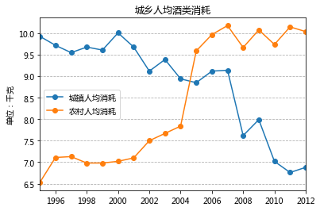


从上图可以看出，1995-2012年，城镇居民人均酒类消耗量一直在下降，而农村居民人均消耗量则一路上升。

对比两端的1995年和2012年，城镇居民和农村居民刚好掉了个儿。

这大概可以很好地说明：随着生活水平的提高和健康意识的逐渐提升，人均酒类消耗会呈现倒V字型，即先上升后下降，但转折点在哪里则很难判断。

#### 各地区农村人均酒类消耗量

数据来自国家统计局，其中东部、中部、西部和东北地区的具体划分为：

东部10省（市）包括北京、天津、河北、上海、江苏、浙江、福建、山东、广东和海南；

中部6省包括山西、安徽、江西、河南、湖北和湖南；

西部12省（区、市）包括内蒙古、广西、重庆、四川、贵州、云南、西藏、陕西、甘肃、青海、宁夏和新疆；

东北3省包括辽宁、吉林和黑龙江。


```python
countryside = pd.read_csv(r'data/countryside.csv')
countryside
```


<div>
<style>
    .dataframe thead tr:only-child th {
        text-align: right;
    }

    .dataframe thead th {
        text-align: left;
    }

    .dataframe tbody tr th {
        vertical-align: top;
    }
</style>
<table border="1" class="dataframe">
  <thead>
    <tr style="text-align: right;">
      <th></th>
      <th>时间</th>
      <th>东部地区</th>
      <th>中部地区</th>
      <th>西部地区</th>
      <th>东北地区</th>
    </tr>
  </thead>
  <tbody>
    <tr>
      <th>0</th>
      <td>2005</td>
      <td>13.19</td>
      <td>7.88</td>
      <td>6.51</td>
      <td>15.55</td>
    </tr>
    <tr>
      <th>1</th>
      <td>2006</td>
      <td>12.93</td>
      <td>8.65</td>
      <td>7.13</td>
      <td>15.96</td>
    </tr>
    <tr>
      <th>2</th>
      <td>2007</td>
      <td>13.29</td>
      <td>8.65</td>
      <td>7.23</td>
      <td>16.95</td>
    </tr>
    <tr>
      <th>3</th>
      <td>2008</td>
      <td>12.00</td>
      <td>8.27</td>
      <td>7.32</td>
      <td>16.34</td>
    </tr>
    <tr>
      <th>4</th>
      <td>2009</td>
      <td>12.53</td>
      <td>8.64</td>
      <td>7.56</td>
      <td>17.27</td>
    </tr>
    <tr>
      <th>5</th>
      <td>2010</td>
      <td>11.85</td>
      <td>8.27</td>
      <td>7.56</td>
      <td>16.91</td>
    </tr>
    <tr>
      <th>6</th>
      <td>2011</td>
      <td>11.71</td>
      <td>8.92</td>
      <td>7.79</td>
      <td>20.44</td>
    </tr>
  </tbody>
</table>
</div>


```python
del countryside['时间']
countryside.index = range(2005, 2012)
```


```python
countryside.plot(kind='bar')
plt.grid(axis='y', linestyle='--')
plt.legend(bbox_to_anchor=(1, 0.75))
plt.title('农村各地区人均酒类消费')
plt.ylabel('单位：千克')
plt.show()
```


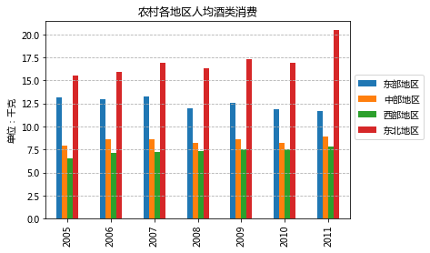


从图中可以看出，不同农村地区人均酒类消耗相差很大。

从不同地区来看，东北地区>东部地区>中部地区>西部地区

从不同年份来看，除了东部地区人均酒类消耗下降外，其他三个地区人均消耗均在增加。
这里体现出来的趋势与上面提到的一致，即人均酒类消费会呈现倒V字型。


```python

```
